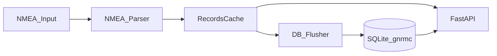

# NMEA-API-Service

Асинхронный сервис для приема NMEA-потока (`$GNRMC/$GPRMC` и `$GNGGA/$GPGGA`), кэширования координат, периодической записи в SQLite и публикации данных через HTTP API.

Спецификации HTTP API:
- **v2** (префикс `/api/navigator/v1/`, `GET /api/ping`, JSON в kebab-case, без Bearer): [doc/API-PROTOCOL-v2.md](doc/API-PROTOCOL-v2.md);
- **legacy v1** (пути `/LastCoords`, `/AllCoords`, `/DeleteRecord/...`, Bearer обязателен): [doc/API-PROTOCOL-v1.md](doc/API-PROTOCOL-v1.md).

## Назначение

Сервис решает задачу "порт/файл NMEA -> API":
- читает NMEA строки из serial-порта, файла или `stdin`;
- парсит координаты, курс, скорость, валидность и режим;
- дополняет RMC-записи количеством спутников из GGA;
- хранит свежие данные в оперативном кэше;
- пакетно сохраняет данные в SQLite с ограничением по `MaxRows`;
- отдает последние и исторические координаты по HTTP: контракт **v2** без авторизации и **legacy v1** с Bearer (см. документы в `doc/`).

## Возможности

- Асинхронный рантайм: reader + flusher + API server в одном процессе.
- Два набора HTTP-маршрутов: **v2** (публичные данные + ping) и **legacy** с Bearer-токеном.
- Гибкий источник входных данных: serial / file / stdin.
- Ограниченный in-memory кэш с триггером flush в БД.
- Retention-аудит таблицы SQLite по лимиту строк.

## Архитектура



Ключевые модули:
- `src/main.py` — точка входа и оркестрация задач.
- `src/runner_task.py` — ingestion (`nmea_reader_task`) и flush (`db_flusher_task`).
- `src/nmea/parsing.py` — проверка checksum и парсинг RMC/GGA.
- `src/db/cache.py` — модель записи и логика in-memory кэша.
- `src/db/sql.py` — инициализация SQLite, batch insert, retention.
- `src/api_server.py` — FastAPI-приложение, middleware авторизации, эндпоинты.
- `src/models/data_models.py` — загрузка и типизация TOML-конфига.

## Логика работы

1. Процесс стартует через `src/main.py` и загружает TOML-конфиг (`--config`).
2. Инициализируются логгер, SQLite и `RecordsCache`.
3. Поднимаются три async-задачи:
   - `nmea_reader_task`: читает строки, обновляет satellites из GGA, парсит RMC, пишет в кэш;
   - `db_flusher_task`: по событию flush сохраняет все записи кэша в SQLite и применяет retention;
   - FastAPI/Uvicorn server: обслуживает HTTP-запросы.
4. При `SIGINT/SIGTERM` выполняется graceful shutdown и закрытие DB-соединения.

## Требования

- Linux-среда с доступом к serial-устройству (если используется serial-режим).
- Python **3.13** (зафиксировано в `.python-version`; см. также `requires-python` в `pyproject.toml`).
- Установленный `uv` для управления зависимостями и запуска.

## Установка зависимостей (uv)

```bash
uv sync
```

Команда устанавливает зависимости из `pyproject.toml` (и lock-файла при наличии).

Для разработки и тестов (pytest и плагины):

```bash
uv sync --group dev
```

## Конфигурация (TOML)

Используется TOML-файл, пример: `etc/gnrmc-provider.toml`.

Секции и параметры:

- `[Database]`
  - `DB` — путь к SQLite-файлу (например, `data/gnrmc.db`);
  - `MaxRows` — максимальное число строк в таблице `gnrmc` (retention).
- `[Hardware]`
  - `HardwarePort` — serial-порт (например, `/dev/ttyS3`);
  - `Baud` — скорость порта.
- `[API]`
  - `Host` — адрес биндинга API;
  - `HTTP_Port` — TCP порт API;
  - `Workers` — число воркеров uvicorn (из конфига приложения);
  - `Token` — Bearer-токен авторизации.
- `[System]`
  - `ProgramDirectory` — служебный каталог приложения;
  - `Input` — путь к входному файлу NMEA (если непустой, выбирается file-режим);
  - `Stdin` — если `true`, выбирается stdin-режим (когда `Input` пустой);
  - `LogDir` — каталог логов.
- `[Memory]`
  - `CacheRecordsLength` — максимальный размер in-memory кэша;
  - `CacheRecords` — порог новых записей до триггера flush в SQLite.

Приоритет источника входных данных:
1. `System.Input` (файл), если задан;
2. `System.Stdin = true`;
3. иначе serial (`HardwarePort` + `Baud`).

## Запуск (uv)

Рекомендуемый запуск с конфигом из репозитория:

```bash
uv run python src/main.py --config etc/gnrmc-provider.toml
```

Запуск с собственным конфигом:

```bash
uv run python src/main.py --config /absolute/path/to/gnrmc.toml
```

### Примеры режимов

- Serial-режим: `Input = ""`, `Stdin = false`, заполнены `HardwarePort/Baud`.
- File-режим: указать путь в `Input`.
- Stdin-режим: `Input = ""` и `Stdin = true`.

## API

### Контракт v2 (рекомендуется для новых клиентов)

- `GET /api/ping` — проверка доступности (`running`, `timestamp-utc`).
- `GET /api/navigator/v1/last-coords` — последняя запись из кэша; ответы с ключами в **kebab-case**.
- `GET /api/navigator/v1/all-coords?limit=...` — кэш, при нехватке — SQLite; `limit` по умолчанию `10`, диапазон `1..1000`.
- `DELETE /api/navigator/v1/delete-record/{record_id}` — удаление строки в SQLite по `key_id`.

Авторизация для этих маршрутов **не** используется. Подробности и примеры: [doc/API-PROTOCOL-v2.md](doc/API-PROTOCOL-v2.md).

### Legacy v1 (обратная совместимость)

- `GET /LastCoords`, `GET /AllCoords?limit=...`, `DELETE /DeleteRecord/{record_id}` — то же поведение данных, JSON с ключами как в v1 (`record_id`, `lat_hemisphere`, …).

Обязательный заголовок:

```text
Authorization: Bearer <token>
```

(`<token>` = `[API].Token` в TOML.) Полное описание: [doc/API-PROTOCOL-v1.md](doc/API-PROTOCOL-v1.md).

### Служебные URL FastAPI

Пути вроде `/docs`, `/openapi.json`, `/redoc` **не** входят в публичные маршруты v2: для них действует тот же Bearer-middleware, что и для legacy (без токена — `401`).

## Тесты

После `uv sync --group dev`:

```bash
uv run pytest -v
```

Запуск только файла с тестами API (из корня репозитория):

```bash
uv run tests/test_api_endpoints.py -v
```

(под капотом вызывается `python -m pytest` в отдельном процессе, чтобы не было лишних предупреждений pytest).

## CI

В репозитории есть workflow GitHub Actions [`.github/workflows/test.yml`](.github/workflows/test.yml): `uv sync --group dev`, затем `uv run pytest -v` (версия Python из `.python-version`).

## Структура проекта

```text
src/
  main.py
  api_server.py
  runner_task.py
  models/data_models.py
  nmea/parsing.py
  db/cache.py
  db/sql.py
  serial_port/line_iterators.py
tests/
  conftest.py
  test_api_endpoints.py
doc/
  API-PROTOCOL-v1.md
  API-PROTOCOL-v2.md
etc/
  gnrmc-provider.toml
examples/
  uvicorn-in-gnrmc-log.py
.github/workflows/
  test.yml
.python-version
data/
logs/
```

## Диагностика и типовые проблемы

- `401 Unauthorized` на **legacy**-путях или на `/docs` / OpenAPI:
  - передайте `Authorization: Bearer <token>`;
  - убедитесь, что токен совпадает с `[API].Token`.
- Запросы к **v2** (`/api/ping`, `/api/navigator/v1/...`) токен не требуют; если ожидаете 401 только на старых путях — проверьте URL.
- Нет данных в API:
  - проверьте источник входа (`Input`/`Stdin`/serial);
  - убедитесь, что входной поток содержит корректные NMEA строки с валидным checksum.
- Ошибка доступа к serial-порту:
  - проверьте существование устройства (`HardwarePort`) и права пользователя.
- БД растет слишком быстро:
  - скорректируйте `MaxRows` и `CacheRecords`.

## Примечание по управлению зависимостями

В проекте принят `uv`-workflow: установка и запуск через `uv`, источник зависимостей — `pyproject.toml`.
