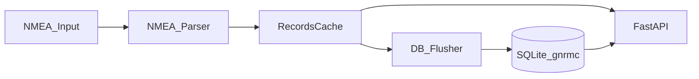

# NMEA-API-Service

Асинхронный сервис для приема NMEA-потока (`$GNRMC/$GPRMC` и `$GNGGA/$GPGGA`), кэширования координат, периодической записи в SQLite и публикации данных через HTTP API.

Подробный API-протокол вынесен в `doc/API-PROTOCOL-v1.md`.

## Назначение

Сервис решает задачу "порт/файл NMEA -> API":
- читает NMEA строки из serial-порта, файла или `stdin`;
- парсит координаты, курс, скорость, валидность и режим;
- дополняет RMC-записи количеством спутников из GGA;
- хранит свежие данные в оперативном кэше;
- пакетно сохраняет данные в SQLite с ограничением по `MaxRows`;
- отдает последние и исторические координаты по HTTP с Bearer-аутентификацией.

## Возможности

- Асинхронный рантайм: reader + flusher + API server в одном процессе.
- Токен-авторизация для всех API-эндпоинтов.
- Гибкий источник входных данных: serial / file / stdin.
- Ограниченный in-memory кэш с триггером flush в БД.
- Retention-аудит таблицы SQLite по лимиту строк.

## Архитектура



Ключевые модули:
- `src/main.py` — точка входа и оркестрация задач.
- `src/runner_task.py` — ingestion (`nmea_reader_task`) и flush (`db_flusher_task`).
- `src/nmea/parsing.py` — проверка checksum и парсинг RMC/GGA.
- `src/db/cache.py` — модель записи и логика in-memory кэша.
- `src/db/sql.py` — инициализация SQLite, batch insert, retention.
- `src/api_server.py` — FastAPI-приложение, middleware авторизации, эндпоинты.
- `src/models/data_models.py` — загрузка и типизация TOML-конфига.

## Логика работы

1. Процесс стартует через `src/main.py` и загружает TOML-конфиг (`--config`).
2. Инициализируются логгер, SQLite и `RecordsCache`.
3. Поднимаются три async-задачи:
   - `nmea_reader_task`: читает строки, обновляет satellites из GGA, парсит RMC, пишет в кэш;
   - `db_flusher_task`: по событию flush сохраняет все записи кэша в SQLite и применяет retention;
   - FastAPI/Uvicorn server: обслуживает HTTP-запросы.
4. При `SIGINT/SIGTERM` выполняется graceful shutdown и закрытие DB-соединения.

## Требования

- Linux-среда с доступом к serial-устройству (если используется serial-режим).
- Python `>=3.13` (см. `pyproject.toml`).
- Установленный `uv` для управления зависимостями и запуска.

## Установка зависимостей (uv)

```bash
uv sync
```

Команда устанавливает зависимости из `pyproject.toml` (и lock-файла при наличии).

## Конфигурация (TOML)

Используется TOML-файл, пример: `etc/gnrmc-provider.toml`.

Секции и параметры:

- `[Database]`
  - `DB` — путь к SQLite-файлу (например, `data/gnrmc.db`);
  - `MaxRows` — максимальное число строк в таблице `gnrmc` (retention).
- `[Hardware]`
  - `HardwarePort` — serial-порт (например, `/dev/ttyS3`);
  - `Baud` — скорость порта.
- `[API]`
  - `Host` — адрес биндинга API;
  - `HTTP_Port` — TCP порт API;
  - `Workers` — число воркеров uvicorn (из конфига приложения);
  - `Token` — Bearer-токен авторизации.
- `[System]`
  - `ProgramDirectory` — служебный каталог приложения;
  - `Input` — путь к входному файлу NMEA (если непустой, выбирается file-режим);
  - `Stdin` — если `true`, выбирается stdin-режим (когда `Input` пустой);
  - `LogDir` — каталог логов.
- `[Memory]`
  - `CacheRecordsLength` — максимальный размер in-memory кэша;
  - `CacheRecords` — порог новых записей до триггера flush в SQLite.

Приоритет источника входных данных:
1. `System.Input` (файл), если задан;
2. `System.Stdin = true`;
3. иначе serial (`HardwarePort` + `Baud`).

## Запуск (uv)

Рекомендуемый запуск с конфигом из репозитория:

```bash
uv run python src/main.py --config etc/gnrmc-provider.toml
```

Запуск с собственным конфигом:

```bash
uv run python src/main.py --config /absolute/path/to/gnrmc.toml
```

### Примеры режимов

- Serial-режим: `Input = ""`, `Stdin = false`, заполнены `HardwarePort/Baud`.
- File-режим: указать путь в `Input`.
- Stdin-режим: `Input = ""` и `Stdin = true`.

## API

Кратко:
- `GET /LastCoords` — последняя запись из кэша.
- `GET /AllCoords?limit=...` — сначала кэш, при нехватке добирает из SQLite.
- `DELETE /DeleteRecord/{record_id}` — удаление записи из SQLite.

Все запросы требуют заголовок:

```text
Authorization: Bearer <token>
```

Полное описание форматов запросов/ответов и кодов статуса: `doc/API-PROTOCOL-v1.md`.

## Структура проекта

```text
src/
  main.py
  api_server.py
  runner_task.py
  models/data_models.py
  nmea/parsing.py
  db/cache.py
  db/sql.py
  serial_port/line_iterators.py
etc/
  gnrmc-provider.toml
examples/
  uvicorn-in-gnrmc-log.py
data/
logs/
```

## Диагностика и типовые проблемы

- `401 Unauthorized`:
  - проверьте `Authorization: Bearer <token>`;
  - убедитесь, что токен совпадает с `[API].Token`.
- Нет данных в API:
  - проверьте источник входа (`Input`/`Stdin`/serial);
  - убедитесь, что входной поток содержит корректные NMEA строки с валидным checksum.
- Ошибка доступа к serial-порту:
  - проверьте существование устройства (`HardwarePort`) и права пользователя.
- БД растет слишком быстро:
  - скорректируйте `MaxRows` и `CacheRecords`.

## Примечание по управлению зависимостями

В проекте принят `uv`-workflow: установка и запуск через `uv`, источник зависимостей — `pyproject.toml`.
