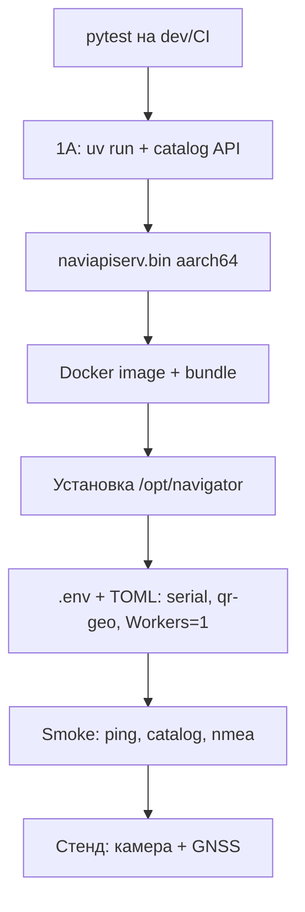

# Roadmap: сборка, запуск и тестирование на целевой плате

Целевая платформа: **Rockchip RK3588**, Ubuntu 20.04, **aarch64**.  
Стек: Docker-образ `navigator:2-kalman-ecef` (NavAPI + NDTP), опционально QR-reader на стенде.

Два пути на плату + локальный dev без контейнера:

| Путь | Когда | Где |
|------|--------|-----|
| **1A. Dev uv** | Отладка API/QrStore без Docker | Dev-машина, `uv run python` |
| **A. Prod bundle** | Поставка / стенд «как в поле» | Dev-машина (buildx arm64) → tar на плату |
| **B. Dev on board** | Итерации на плате с bind-mount | Сборка Docker прямо на плате |

Автотесты pytest — на CI/dev-машине; на плате — smoke + стенд с железом.

---

## 0. Предварительные условия

### Dev-машина (путь A)

- Docker + `buildx` + binfmt для `linux/arm64`
- Собранный `naviapiserv.bin` (aarch64) и `NDTP_Client`
- Доступ к репозиторию / артефактам

### Целевая плата

- Docker + Compose plugin
- Serial GPS: `/dev/ttyS0` или `/dev/ttyS3` (группа `dialout`)
- Для QR на стенде: запущенный QR-reader-API и сеть до его `/events` (часто `network_mode: host`)
- Свободный порт NavAPI (в конфиге Docker по умолчанию **7100**)

### Секреты

- Файл `.env` **не в git**: `NAVAPI_API_TOKEN=<секрет>`
- Пример: [`.env.example`](../.env.example), [`docker/.env.example`](../docker/.env.example)
- Генерация: `openssl rand -hex 32`

---

## 1. Автотесты до выезда на плату (dev / CI)

На x86/aarch64 с Python 3.13 + `uv`:

```bash
cd NMEA-API-Service
uv sync --group dev
uv run pytest -q
```

Критично для QR-ветки: `tests/test_qr_geo_*.py`, `tests/test_resolve_api_token.py`, hub/API.

Железо и живой QR-reader **не** входят в CI (см. [plan/04_QR-GEO-PROVIDER.md](../plan/04_QR-GEO-PROVIDER.md)).

**Чеклист:** все pytest зелёные → можно собирать бинарник/образ.

---

## 1A. Dev без Docker: проверка QrStore и каталога

Локальный запуск через `uv` / Python **без** сборки образа и без платы. Подходит, чтобы отладить загрузку/обновление справочника (`QrGeoStore` + API). SSE-адаптер QR-reader можно не включать (`Enabled = false`): store и HTTP каталога всё равно поднимаются.

### Подготовка

```bash
cd NMEA-API-Service
uv sync --group dev

# токен (приоритетнее [API].Token в TOML)
export NAVAPI_API_TOKEN=dev-local-token
# либо в .env в корне репозитория (load_dotenv при старте):
#   NAVAPI_API_TOKEN=dev-local-token
```

Конфиг: [`etc/gnrmc-provider.toml`](../etc/gnrmc-provider.toml).

- `[API] HTTP_Port = 7000`, `Workers = 1`
- `[Sources.qr-geo] GeoDbPath = "data/qr_geo.db"` (создаётся при старте)
- `[Sources.qr-geo] Enabled = false` — достаточно для проверки store/API
- Если нет serial: задайте `[System] Input` на файл с NMEA **или** временно отключите nmea (`Enabled = false`) — иначе reader будет ругаться на порт

Запуск (из корня; `PYTHONPATH` через `uv run` + код в `src`):

```bash
cd src
uv run python main.py --config ../etc/gnrmc-provider.toml
```

В другом терминале:

```bash
export TOKEN=dev-local-token
export BASE=http://127.0.0.1:7000
curl -sS "$BASE/api/ping"
```

В логах ожидайте инициализацию `QrGeoStore` / `QrGeoLookup reloaded`. Файл БД: `data/qr_geo.db` (путь относительно cwd — при запуске из `src` это `src/data/…` либо задайте абсолютный `GeoDbPath`).

Рекомендация для предсказуемого пути:

```toml
# в etc/gnrmc-provider.toml или копии etc/dev-local.toml
GeoDbPath = "/tmp/qr_geo_dev.db"
```

### Полная загрузка (replace)

Очищает таблицу и заливает файл целиком. Пустой набор → `422`.

**JSON body:**

```bash
curl -sS -X POST "$BASE/api/qr-geo/v1/catalog:replace" \
  -H "Authorization: Bearer $TOKEN" \
  -H "Content-Type: application/json" \
  -d '[
    {"qr-value":"STOP-1","latitude":"55,751244","longitude":37.618423,"label":"точка 1"},
    {"qr-value":"STOP-2","latitude":55.76,"longitude":37.64}
  ]'
# {"result":true,"count":2,"format":"json","mode":"replace"}
```

**CSV файл:**

```bash
cat > /tmp/qr_geo.csv <<'EOF'
qr-value,latitude,longitude,label
STOP-1,"55,751244",37.618423,точка 1
STOP-2,55.76,37.64,точка 2
EOF

curl -sS -X POST "$BASE/api/qr-geo/v1/catalog:replace" \
  -H "Authorization: Bearer $TOKEN" \
  -F "file=@/tmp/qr_geo.csv;type=text/csv"
```

### Обновление / добавление (append)

Upsert по `qr-value`: существующие ключи обновляются, новые добавляются, остальные строки в БД сохраняются.

```bash
curl -sS -X POST "$BASE/api/qr-geo/v1/catalog:append" \
  -H "Authorization: Bearer $TOKEN" \
  -H "Content-Type: application/json" \
  -d '[
    {"qr-value":"STOP-1","latitude":55.752,"longitude":37.619,"label":"обновлённая"},
    {"qr-value":"STOP-3","latitude":55.77,"longitude":37.65}
  ]'
# count = число записей в запросе (2), не размер всей БД
```

### Как убедиться, что Store обновился

1. **Ответ API** — `result: true`, ожидаемый `count` / `mode`.
2. **SQLite напрямую:**

```bash
sqlite3 /tmp/qr_geo_dev.db 'SELECT qr_value, latitude, longitude, label, enabled FROM qr_geo ORDER BY qr_value;'
```

3. **Повторный replace** с одним ключом → в SELECT останется только он (полная перезапись).
4. **Ошибки валидации** (отрицательные координаты, дубликаты в файле) → `422`, БД **не** меняется:

```bash
curl -sS -X POST "$BASE/api/qr-geo/v1/catalog:replace" \
  -H "Authorization: Bearer $TOKEN" \
  -H "Content-Type: application/json" \
  -d '[{"qr-value":"BAD","latitude":-1,"longitude":10}]'
# result false, errors[...]; SELECT без изменений
```

5. **Auth:** без заголовка или с неверным Bearer → `401`.

6. **Юнит/API-тесты без сервера:**

```bash
uv run pytest tests/test_qr_geo_store.py tests/test_qr_geo_api.py tests/test_qr_geo_validate.py -q
```

### Опционально: mock-публикация без камеры

Store проверяется через API выше. Чтобы увидеть `source=qr` в `last-coords`, нужен либо живой QR-reader + `Enabled=true`, либо автотест `tests/test_qr_geo_adapter.py` (payload в lookup без SSE).

**Чеклист 1A:** ping OK; replace JSON/CSV OK; append меняет/добавляет строки в sqlite3; 422/401 ведут себя ожидаемо.

---

## 2. Сборка `naviapiserv.bin` (aarch64)

Надёжный вариант — **native aarch64** (плата или aarch64 builder):

```bash
bash scripts/build-naviapiserv-aarch64.sh
```

Артефакт: `naviapiserv.bin` (onefile).  
Положить в дерево Docker-сборки:

```text
docker/NavAPIServer/bin/naviapiserv.bin
docker/NDTPClient/bin/NDTP_Client   # отдельно из своего пайплайна
```

Подробности: [README.md](../README.md) § «Сборка standalone-бинарника».

**Чеклист:** бинарник запускается на aarch64 (`./naviapiserv.bin --help` / короткий smoke вне Docker при необходимости).

---

## 3A. Prod: образ и bundle на dev-машине

Один раз (buildx):

```bash
docker buildx create --name navigator-builder --use 2>/dev/null || docker buildx use navigator-builder
docker run --privileged --rm tonistiigi/binfmt --install all
```

Сборка:

```bash
# бинарники уже в docker/NavAPIServer/bin и docker/NDTPClient/bin
bash docker/docker/build-off-board.sh
```

Артефакты в `docker/`:

- `navigator-2-kalman-ecef-YYYYMMDD.tar.gz` — образ
- `NavigatorDockerApp-KF-ECEF-YYYYMMDD.tar.gz` — deploy bundle

Скопировать bundle на плату (scp/usb).

**Чеклист:** оба tar на целевой машине.

---

## 3B. Dev: сборка на плате

```bash
cd /path/to/NMEA-API-Service/docker
cp .env.example .env
# отредактировать NAVAPI_API_TOKEN=
docker compose -f docker-compose.dev.yml up -d --build
```

Конфиги и БД — bind-mount (`./etc`, `./NavAPIServer/db`, `./log`).  
Дальше — шаги 5–7 (конфиг / smoke / стенд).

---

## 4. Установка prod-bundle на плате

```bash
tar -xzf NavigatorDockerApp-KF-ECEF-YYYYMMDD.tar.gz
cd NavigatorDockerApp   # имя каталога из bundle
sudo ./install-docker-from-tar.sh --copy-to-opt
```

Структура:

```text
/opt/navigator/
  docker-compose.yml
  .env                 # создать вручную
  etc/  → /etc/navigator (ro)
  db/   → /db (rw)     # gnrmc.db, qr_geo.db
  log/  → /log (rw)
```

См. [docker/README-deploy.md](../docker/README-deploy.md).

**Чеклист:** `/opt/navigator` существует, образ загружен (`docker images | grep navigator`).

---

## 5. Конфигурация на плате

### 5.1 Токен

```bash
sudo tee /opt/navigator/.env >/dev/null <<'EOF'
NAVAPI_API_TOKEN=вставить_секрет
EOF
sudo chmod 600 /opt/navigator/.env
```

### 5.2 NavAPI TOML (`/opt/navigator/etc/navapiserv-config.toml`)

Проверить/выставить:

| Параметр | Типично на плате |
|----------|------------------|
| `[Sources.nmea] HardwarePort` / `Baud` | `/dev/ttyS0` @ 19200 или `/dev/ttyS3` @ 9600 |
| `[API] HTTP_Port` | `7100` |
| `[API] Workers` | **`1`** (обязательно для кэша/SSE) |
| `[API] Token` | можно пусто — приоритет у `NAVAPI_API_TOKEN` |
| `[Sources.qr-geo] Enabled` | `true` на стенде с QR-reader |
| `[Sources.qr-geo] EventsUrl` | URL SSE, напр. `http://127.0.0.1:7140/api/qr-reader/v1/events` |
| `[Sources.qr-geo] EventTimeSource` | `event` (рекомендуется с NMEA) или `load-image` |
| `[Sources.qr-geo] GeoDbPath` | `/db/qr_geo.db` |

NDTP: `/opt/navigator/etc/ndtp-client.toml` — порт к NavAPI (`7100`).

### 5.3 Запуск

```bash
cd /opt/navigator
sudo docker compose up -d --no-build
# после смены .env / серьёзных правок:
# sudo docker compose up -d --force-recreate --no-build
```

Логи:

```bash
sudo docker compose logs -f --tail=100
# или файлы в /opt/navigator/log/
```

**Чеклист:** контейнер `Up`, в логах нет ошибки токена/serial; `GeoDbPath` создаётся при старте.

---

## 6. Smoke-тесты на плате (без камеры)

Базовый URL (host network): `http://127.0.0.1:7100`

```bash
export TOKEN="$(grep NAVAPI_API_TOKEN /opt/navigator/.env | cut -d= -f2-)"
export BASE=http://127.0.0.1:7100
```

### 6.1 Жив ли API

```bash
curl -sS "$BASE/api/ping"
# ожидаем: "running":"OK"
```

### 6.2 NMEA / last-coords

```bash
curl -sS "$BASE/api/navigator/v1/last-coords"
curl -sS "$BASE/api/navigator/v2/all-coords?provider=nmea" | head -c 500
```

При подключённом GNSS: `result: true`, `source` вида `nmea/rmc` (или fusion).  
Без антенны: допустим `result: false` / нет точек — смотреть serial в логах.

### 6.3 Заливка справочника QR

```bash
curl -sS -X POST "$BASE/api/qr-geo/v1/catalog:replace" \
  -H "Authorization: Bearer $TOKEN" \
  -H "Content-Type: application/json" \
  -d '[{"qr-value":"TEST-QR-1","latitude":"55,75","longitude":37.62}]'
# ожидаем: result true, count 1
```

Проверка auth:

```bash
curl -sS -o /dev/null -w "%{http_code}\n" \
  -X POST "$BASE/api/qr-geo/v1/catalog:replace" \
  -H "Content-Type: application/json" -d '[]'
# ожидаем: 401
```

### 6.4 Legacy с Bearer

```bash
curl -sS -H "Authorization: Bearer $TOKEN" "$BASE/LastCoords"
```

**Чеклист smoke:** ping OK; catalog replace 200; без токена 401; при GNSS — точки `provider=nmea`.

---

## 7. Стенд: NMEA + QR вместе

Предусловия: QR-reader-API слушает SSE; в TOML `[Sources.qr-geo] Enabled = true` и верный `EventsUrl`; справочник залит (шаг 6.3) с **реальными** `qr-value` с меток.

```bash
# поток last для QR
curl -N "$BASE/api/navigator/v2/last-coords?provider=qr"

# в другом терминале — все источники
curl -sS "$BASE/api/navigator/v2/all-coords" | head -c 2000
```

Сценарий:

1. Показать камере известный QR из справочника → событие `qr-detected` → в NavAPI запись `source=qr`.
2. Неизвестный / ложный код → **нет** публикации (lookup miss).
3. Параллельно GNSS → записи `nmea/*` в том же кэше.
4. Фильтры `provider=qr` / `provider=nmea` разделяют потоки.

**Чеклист стенда:** hit → `source=qr`, `quality=GOOD`; miss → тишина в qr-потоке; nmea не пропадает.

---

## 8. Регрессия после обновления

1. Собрать новый bin + bundle (шаги 2–3A) или `compose ... --build` (3B).
2. Сохранить `/opt/navigator/db/` и `/opt/navigator/.env` не требуется вручную при обновлении через `install-docker-from-tar.sh --copy-to-opt` — скрипт исключает их из `rsync --delete`.
3. Обновить образ/бинарник, `compose up -d --force-recreate --no-build`.
4. Повторить §6; при стенде — §7.
5. Ротация токена: новый `NAVAPI_API_TOKEN` в `.env` → recreate → обновить клиенты/скрипты заливки.

---

## 9. Порядок работ (краткий)



| Этап | Где | Результат |
|------|-----|-----------|
| 1. pytest | dev/CI | Регрессия кода |
| 1A. uv + catalog | dev без Docker | QrStore replace/append проверен |
| 2. bin | aarch64 | `naviapiserv.bin` |
| 3. image/bundle | dev (A) или плата (B) | Образ Docker |
| 4–5. install + config | плата | Сервис Up + токен |
| 6. smoke | плата | API и справочник |
| 7. стенд | плата + камера | nmea + qr |

---

## Ссылки

- [docker/README-deploy.md](../docker/README-deploy.md) — установка bundle  
- [doc/API-PROTOCOL-v2.md](API-PROTOCOL-v2.md) — API, в т.ч. `/api/qr-geo`  
- [plan/04_QR-GEO-PROVIDER.md](../plan/04_QR-GEO-PROVIDER.md) — архитектура QR  
- [scripts/build-naviapiserv-aarch64.sh](../scripts/build-naviapiserv-aarch64.sh) — Nuitka aarch64  
- [docker/docker/build-off-board.sh](../docker/docker/build-off-board.sh) — образ arm64  
