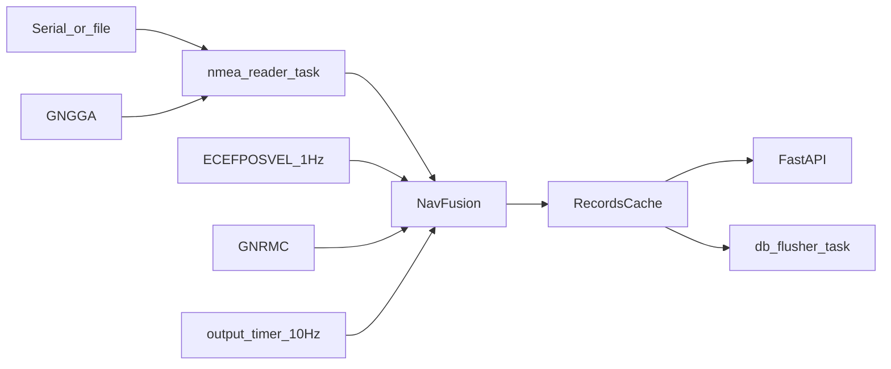

# План: онлайн-навигация GNRMC + Kalman / ECEFPOSVEL

> **Superseded by [KALMAN-ECEF-FUSION-v2.md](KALMAN-ECEF-FUSION-v2.md)** для поведения fusion v2 (стоянка, PublishMode, Workers=1).

Спецификация fusion-слоя для NMEA-API-Service.

**Версия релиза (целевая):** `v2-kalman-ecef`  
**Docker-образ:** `navigator:2-kalman-ecef`  
**Каталог deploy bundle после распаковки:** `NavigatorDockerApp-KF-ECEF/`

---

## 1. Контекст и цели

### 1.1. Задача

Обеспечить **ритмичную online-выдачу** корректных координат при:

- стабильном потоке валидных `$GNRMC`;
- паузах GNRMC (редкие или длинные строки);
- `is_valid=V` (ослабленное доверие, не полный отказ);
- разных типах ТС: **трамвай** (~0–25 км/ч) и **автобус** (кратковременно до ~80 км/ч).

### 1.2. Источники данных

| Источник | Роль |
|----------|------|
| **GNRMC** | Истина по **позиции**, когда строка прошла гейты |
| **ECEFPOSVEL** | Измерения позиции и скорости (1 Гц) при паузах GNRMC |
| **GNGGA** | Только `satellites_count` (как сейчас) |
| **GNVTG** | Не использовать как первичный источник (нет timestamp, дублирует RMC) |

### 1.3. Принципы

1. **Только online** — каждый тик выдаёт лучшую оценку «на сейчас».
2. **Нет backfill** — после возврата GNRMC историю за паузу **не пересчитываем**; новый RMC корректирует состояние вперёд (возможен видимый скачок — честный trade-off).
3. **Один фильтр состояния** — gated Kalman CV в локальной ENU; выход 10 Гц через `predict(Δt)`.
4. **Профиль ТС** — именованная секция в [`etc/VehicleProfiles.toml`](../etc/VehicleProfiles.toml); главный TOML указывает только `Profile` и путь к файлу профилей.

### 1.4. Текущее vs целевое поведение

Сейчас в [`src/runner_task.py`](../src/runner_task.py) после первого RMC флаг `use_rmc_source` **блокирует** ECEFPOSVEL. Целевое: **оба потока** поступают в fusion; в кэш/API пишется результат фильтра, а не сырой RMC/ECEF по отдельности.

---

## 2. Выводы из анализа логов

Сводка по `debug/nmea.log`, `debug/nmea-wo_GLONASS.log`, `debug/nmea-row-tram4.log`.

| Наблюдение | `nmea.log` | `nmea-wo_GLONASS` | `nmea-row-tram4` |
|------------|------------|-------------------|------------------|
| ECEF ритм | 1.00 Гц | 1.00 Гц | ~1.00 Гц |
| GNRMC покрытие | ~41% сек | ~94% | ~59% |
| RMC↔ECEF (одна сек) | ~0.08 м mean | ~0.05 м | ~0.26 м mean, медиана **0.06 м** |
| Паузы GNRMC | 23–49 с | до 23 с | до **657 с** |
| Сырой ECEF без RMC | уводит | 3 multipath ~7 м | **mean ~220 м**, 77% >5 м |
| ECEF при паузе ≤10 с | — | ~0.3 м | **~0.6 м** (filtered) |

**Практические выводы:**

- При совпадении секунды **GNRMC — эталон позиции**; ECEF согласован на дециметровом уровне.
- **Короткие паузы RMC (≤10 с):** ECEF + Kalman + гейты — приемлемый online-fallback.
- **Длинные паузы:** сырой ECEF **нельзя** доверять; только `COAST` / `DEGRADED` до следующего RMC.
- Поле **`speed` в RMC ненадёжно** (в `tram4` до 272 км/ч при неподвижной точке) — скорость и курс из **Δpos**.
- **Старт до первого GNRMC:** ECEF хаотичен — fusion **не инициализировать** без якоря RMC.
- Битые ECEF (`00000-0.000`) — отбрасывать на parse.

---

## 3. Архитектура



### 3.1. Потоки

| Поток | Частота | Действие |
|-------|---------|----------|
| Вход NMEA | асинхронно | parse RMC / ECEF / GGA → `fusion.ingest()` |
| Fusion update | ~1 Гц (по ECEF/RMC) | predict + gated update |
| Выход | **10 Гц** (100 мс) | `fusion.predict(0.1s)` → `Record` в кэш |

### 3.2. Модуль (новый)

Предлагаемый путь: [`src/navigation/fusion.py`](../src/navigation/fusion.py)

- `NavFusion` — state machine + Kalman CV в ENU
- `VehicleProfile` — лимиты из конфига
- `FusionOutput` — lat, lon, speed, direction, quality, source

Интеграция: [`src/runner_task.py`](../src/runner_task.py) вызывает fusion вместо прямого `_cache_parsed_record` для навигационных точек; таймер 10 Гц — в [`src/main.py`](../src/main.py).

---

## 4. Режимы online

| Режим | Условие | Поведение | `quality` |
|-------|---------|-----------|-----------|
| **TRUTH** | GNRMC в эту секунду, гейты OK | `x ← RMC`, сброс/ужесточение P | `GOOD` |
| **KF_ECEF** | RMC нет, `t_since_rmc ≤ t_hold` | predict + ECEF update (gated) | `KF_ECEF` |
| **COAST** | RMC нет, ECEF отвергнут | только predict по v | `COAST` |
| **DEGRADED** | `t_hold < t_since_rmc ≤ t_lost` | predict, затухание v (если не стоянка) | `DEGRADED` |
| **LOST** | `t_since_good > t_lost` | не публиковать или last + флаг | `LOST` |

` t_since_good ` — время с последнего **принятого** измерения (RMC или ECEF).

---

## 5. Обработка GNRMC (когда есть)

1. **CRC** — как в [`parse_rmc`](../src/nmea/parsing.py).
2. **`is_valid`:** `A` — полное доверие позиции; `V` — update с увеличенным R (×5–10), не discard всего состояния.
3. **Гейт скорости по позиции:**  
   `v_impl = haversine(P_prev, P_rmc) / Δt` → reject update если `v_impl > v_max`.
4. **Гейт ускорения:** `|v_impl − v_prev| / Δt > a_max` → reject или inflate R.
5. **Анти-откат:** при `v > v_min` (≈1 м/с): dot(Δpos, v_prev) < 0 → reject.
6. **Скорость/курс на выходе** — из Δpos RMC, не из поля knots в строке.
7. При reject RMC: не менять позицию; режим `COAST`/`DEGRADED`; опора на Kalman/ECEF.

При accept: жёсткая коррекция состояния Kalman (малый R, при необходимости reset P).

---

## 6. Kalman CV в ENU (при отсутствии GNRMC)

### 6.1. Состояние

`x = [E, N, vE, vN]ᵀ` в касательной ENU к последнему хорошему RMC.

**Измерение** от ECEFPOSVEL (1 Гц): позиция → E,N; (vx,vy,vz) → vE,vN.

### 6.2. Predict (каждые Δt, в т.ч. 100 мс)

```
x ← F·x ,  P ← F·P·Fᵀ + Q(Δt, a_max)
F: E += vE·Δt , N += vN·Δt
Q из a_max профиля ТС
```

### 6.3. Update (1 Гц, если прошёл gate)

```
y = z − H·x
S = H·P·Hᵀ + R
if |y| > k·√diag(S) → skip update (innovation gating)
else Kalman update
```

### 6.4. Гейты на ECEF (до update)

Пороги берутся из активной секции `VehicleProfiles.toml` (`tram` / `bus` / `custom`):

| Проверка | tram (пример) | bus (пример) |
|----------|---------------|--------------|
| `|Δpos|/Δt` | ≤ `VMaxKmh` (25 км/ч) | ≤ `VMaxKmh` (80 км/ч) |
| frozen ≥ `StandstillSec` с + скачок | > `FrozenJumpM` (2 м) → skip | > `FrozenJumpM` (5 м) → skip |
| innovation (позиция) | `InnovGateSigma`, min `InnovGateMinM` | то же, больший min |

### 6.5. Детектор стоянки

`|Δpos| < StandstillPosM` за ≥ `StandstillSec` с → `v := 0`, Q→минимум, R_vel велико (не доверять шуму скорости ECEF). Параметры из `VehicleProfile`.

### 6.6. Когда Kalman уместен online

- пауза RMC **1…t_hold** с;
- стоянка (подавление дрожания);
- автобус на трассе между секундными ECEF;
- выход **10 Гц** между обновлениями ECEF.

**Не применять** update ECEF: до первого RMC; при LOST; при явном расхождении с последним хорошим RMC (> порога).

---

## 7. Конфигурация TOML и профили ТС

Параметры fusion **не дублируются** в главном конфиге: числовые лимиты живут в отдельном файле профилей. Главный TOML выбирает **имя профиля** и общие опции навигации (частота выхода, рестарт serial).

### 7.1. Файл профилей `etc/VehicleProfiles.toml`

Новый файл в репозитории: [`etc/VehicleProfiles.toml`](../etc/VehicleProfiles.toml).

Секции:

| Секция | Назначение |
|--------|------------|
| `[tram]` | Трамвай, типично 0–25 км/ч |
| `[bus]` | Автобус, кратковременно до ~80 км/ч |
| `[custom]` | Пользовательский набор; активируется при `Profile = "custom"` |

**Шапка файла** (комментарии `#` в начале файла, до секций) — обязательная документация **каждого** параметра всех секций. Пример содержания шапки:

```toml
# =============================================================================
# VehicleProfiles.toml — лимиты fusion для NavFusion (Kalman + гейты)
# =============================================================================
# Используется главным конфигом ([Navigation].Profile + VehicleProfilesPath).
# Секции [tram], [bus], [custom] — взаимоисключающие пресеты; при старте
# загружается ровно одна секция по имени Profile.
#
# VMaxKmh — максимальная правдоподобная скорость (км/ч) для гейта |Δpos|/Δt.
#   Превышение → reject update (RMC или ECEF), только predict/coast.
#
# AMax — максимальное ускорение (м/с²) для гейта |Δv|/Δt между измерениями.
#
# THoldSec — время (с) без GNRMC, в течение которого ещё разрешён ECEF-update
#   в Kalman (режим KF_ECEF). После — только COAST/DEGRADED.
#
# TLostSec — время (с) без принятого измерения (RMC/ECEF); далее quality=LOST,
#   публикация новых точек прекращается (или повтор last — см. API).
#
# FrozenJumpM — при неподвижности (|Δpos| < StandstillPosM) не менее
#   StandstillSec подряд: скачок позиции > FrozenJumpM за 1 с считается multipath.
#
# StandstillPosM — порог (м) приращения позиции для детектора стоянки.
#
# StandstillSec — число секунд подряд ниже StandstillPosM → v := 0, сильное сглаживание.
#
# InnovGateSigma — множитель k для innovation gating Kalman (отбрасывать update
#   при |y| > k·√S).
#
# InnovGateMinM — минимальный порог innovation по позиции (м), независимо от σ.
#
# RmcInvalidInflate — во сколько раз увеличить R при is_valid=V в GNRMC.
#
# SerialRestartAfterSec — см. §8; рекомендуется ≥ TLostSec для этой секции.
#   Может переопределяться в главном [Navigation], если задано явно.
# =============================================================================
```

Пример секций (тело файла):

```toml
[tram]
VMaxKmh = 25
AMax = 1.0
THoldSec = 12
TLostSec = 60
FrozenJumpM = 2.0
StandstillPosM = 0.3
StandstillSec = 3
InnovGateSigma = 3.0
InnovGateMinM = 2.0
RmcInvalidInflate = 8.0
SerialRestartAfterSec = 90

[bus]
VMaxKmh = 80
AMax = 2.5
THoldSec = 25
TLostSec = 90
FrozenJumpM = 5.0
StandstillPosM = 0.3
StandstillSec = 3
InnovGateSigma = 3.0
InnovGateMinM = 5.0
RmcInvalidInflate = 8.0
SerialRestartAfterSec = 120

[custom]
VMaxKmh = 40
AMax = 1.8
THoldSec = 15
TLostSec = 75
FrozenJumpM = 3.0
StandstillPosM = 0.3
StandstillSec = 3
InnovGateSigma = 3.0
InnovGateMinM = 3.0
RmcInvalidInflate = 8.0
SerialRestartAfterSec = 90
```

Деплой: копировать в bundle рядом с `navapiserv-config.toml` (см. §12); путь по умолчанию — относительно `ProgramDirectory` или абсолютный в TOML.

### 7.2. Секция `[Navigation]` в главном конфиге

Файлы: [`etc/gnrmc-provider.toml`](../etc/gnrmc-provider.toml), [`docker/etc/navapiserv-config.toml`](../docker/etc/navapiserv-config.toml).

```toml
[Navigation]
# Имя секции в VehicleProfiles.toml: tram | bus | custom
Profile = "tram"

# Путь к файлу профилей (относительно каталога главного конфига или абсолютный)
VehicleProfilesPath = "VehicleProfiles.toml"

# Частота публикации координат в кэш (Гц); не входит в VehicleProfiles
OutputRateHz = 10

# Рестарт serial (§8); если не задано — берётся SerialRestartAfterSec из профиля
SerialRestartOnRmcLoss = true
# SerialRestartAfterSec = 90   # опционально: override профиля
```

При `Profile = "custom"` загружается секция `[custom]` из `VehicleProfiles.toml`. **Inline-поля `VMaxKmh` и т.д. в главном конфиге не используются** — единый источник правды: файл профилей.

### 7.3. Загрузка в коде

В [`src/models/data_models.py`](../src/models/data_models.py):

```python
@dataclass(frozen=True)
class VehicleProfile:
    v_max_kmh: float
    a_max: float
    t_hold_sec: float
    t_lost_sec: float
    frozen_jump_m: float
    standstill_pos_m: float
    standstill_sec: int
    innov_gate_sigma: float
    innov_gate_min_m: float
    rmc_invalid_inflate: float
    serial_restart_after_sec: float

@dataclass(frozen=True)
class NavigationConfig:
    profile_name: str
    vehicle_profiles_path: Path
    profile: VehicleProfile  # resolved section
    output_rate_hz: int
    serial_restart_on_rmc_loss: bool
    serial_restart_after_sec: float | None  # override
```

Алгоритм `load_config`:

1. Прочитать главный TOML → `[Navigation]`.
2. Разрешить путь `VehicleProfilesPath` относительно директории главного конфига.
3. Загрузить `VehicleProfiles.toml`; выбрать секцию `Profile` (`tram` / `bus` / `custom`).
4. Собрать `VehicleProfile`; при отсутствии секции или ключа — **ошибка старта** с указанием файла и секции.
5. `SerialRestartAfterSec` = override из `[Navigation]` или `profile.serial_restart_after_sec`.

Передать `NavigationConfig` в `NavFusion` и `nmea_reader_task`.

### 7.4. Сводная таблица пресетов

| Параметр | tram | bus | custom (пример) |
|----------|------|-----|-----------------|
| `VMaxKmh` | 25 | 80 | настраивается |
| `AMax` | 1.0 | 2.5 | настраивается |
| `THoldSec` | 12 | 25 | настраивается |
| `TLostSec` | 60 | 90 | настраивается |
| `FrozenJumpM` | 2 | 5 | настраивается |
| `SerialRestartAfterSec` | 90 | 120 | настраивается |

### 7.5. Валидация при старте

- `Profile` ∈ {`tram`, `bus`, `custom`} и соответствующая секция **существует** в `VehicleProfiles.toml`.
- `OutputRateHz` ∈ [1, 20].
- `THoldSec < TLostSec`.
- `SerialRestartAfterSec ≥ TLostSec` (с учётом override).
- `VMaxKmh > 0`, `AMax > 0`, `FrozenJumpM > 0`.

---

## 8. Рестарт serial при отсутствии RMC

### 8.1. Цель

При «зависании» приёмника (нет GNRMC, ECEF идёт) — **переоткрыть serial-порт** без очистки `RecordsCache` и SQLite.

### 8.2. `t_hold` vs `t_lost` vs `SerialRestartAfterSec`

| Параметр | Смысл | Действие |
|----------|-------|----------|
| **`t_hold`** | Ещё доверяем ECEF-update | Kalman `KF_ECEF` |
| **`t_lost`** | Навигация недостоверна | `LOST`, не публиковать (или last) |
| **`SerialRestartAfterSec`** | Порог **аппаратного** recovery | Закрыть/открыть порт, продолжить чтение |

**Рекомендация:** рестарт serial по **`SerialRestartAfterSec`**, не по `t_hold`.

- `t_hold` (12–25 с) — слишком рано для рестарта: краткие паузы RMC нормальны, ECEF ещё полезен.
- `t_lost` (60–90 с) — нижняя граница для рестарта: к этому моменту fusion уже в `DEGRADED`/`LOST`.
- **`SerialRestartAfterSec = 90`** (tram) / **120** (bus) — по умолчанию **равно или чуть больше `t_lost`**, чтобы не дёргать порт при кратковременных провалах.

Последовательность:

1. `t > t_hold` → перестать обновлять из ECEF, только COAST/DEGRADED.
2. `t > t_lost` → `LOST`, прекратить публикацию новых точек (опционально).
3. `t > SerialRestartAfterSec` **и** не было RMC → рестарт serial **один раз**; сбросить таймер; **кэш не чистить**; fusion не re-init без нового RMC.

### 8.3. Реализация (эскиз)

- В `nmea_reader_task`: обёртка `iter_serial_lines` с возможностью `reopen()`.
- Fusion/reader шарит `last_rmc_monotonic` через asyncio-safe счётчик.
- После рестарта: лог `WARNING`, `quality` остаётся `LOST` до первого accept RMC.

---

## 9. Модель записи, SQLite и API

### 9.1. Расширение `Record` (кэш)

В [`src/db/cache.py`](../src/db/cache.py):

```python
quality: Optional[str] = None  # GOOD | KF_ECEF | COAST | DEGRADED | LOST
```

`source`: `nmea` | `ecef` | `fusion` — происхождение последнего измерения, влиявшего на точку.

`to_dict()` — добавить ключ **`quality`** (и в v2 kebab-case: **`nav-quality`**, см. §12.2).

### 9.2. Столбец `quality` в SQLite

Таблица `gnrmc` ([`src/db/sql.py`](../src/db/sql.py)). Миграция по образцу существующей `_ensure_source_column`.

#### Схема

```sql
quality TEXT  -- GOOD | KF_ECEF | COAST | DEGRADED | LOST | NULL для legacy-строк
```

- **Новые БД:** колонка в `CREATE TABLE IF NOT EXISTS gnrmc (...)`.
- **Существующие БД:** `ALTER TABLE gnrmc ADD COLUMN quality TEXT` в `_ensure_quality_column()` при `init_db`, если колонки нет.
- **Значение по умолчанию при INSERT:** для записей fusion — актуальный `quality`; для legacy-пути до fusion — `NULL` или `'GOOD'` если источник — принятый GNRMC (решить при реализации; рекомендация: **`GOOD`** для RMC `A`, иначе `NULL`).

#### Изменения в `sql.py`

1. `_ensure_quality_column(conn, logger)` — аналог `_ensure_source_column`.
2. `CREATE TABLE` — добавить `quality TEXT` после `source`.
3. `insert_many` — расширить INSERT:

```sql
INSERT INTO gnrmc (
    datetime, is_valid, latitude, latitude_hemi, longitude, longitude_hemi,
    speed, direction, mode, satellites_count, source, quality
) VALUES (?, ?, ?, ?, ?, ?, ?, ?, ?, ?, ?, ?)
```

4. `AllCoords` / выборка из БД в [`src/api_server.py`](../src/api_server.py) — включить `quality` в `SELECT` (сейчас явный список колонок).

#### Обратная совместимость

- Старые строки без `quality` → `NULL` в API (клиент трактует как «неизвестно» / legacy).
- Файл БД не пересоздаётся; только `ALTER TABLE`.
- Тест: `tests/` — insert с `quality`, чтение из API, миграция на БД без колонки.

### 9.3. Допустимые значения `quality`

| Значение | Описание |
|----------|----------|
| `GOOD` | Позиция от GNRMC, гейты пройдены |
| `KF_ECEF` | Пауза RMC, обновление из ECEF через Kalman |
| `COAST` | Только predict, ECEF/RMC отвергнуты |
| `DEGRADED` | Долго без RMC, `t_hold` превышен |
| `LOST` | `t_lost` превышен, точка может не публиковаться |

Строковые константы — в `src/navigation/fusion.py` (enum или `Literal`).

### 9.4. API

- **v2:** поле `nav-quality` в JSON ответов `LastCoords` / `AllCoords` — см. [doc/API-PROTOCOL-v2.md](../doc/API-PROTOCOL-v2.md).
- **v1 legacy:** добавить `quality` в объект record (расширение без смены URL); документировать в v1.
- **DELETE / DeleteRecord** — без изменений (`quality` не участвует).

---

## 10. Ограничения и ожидаемое поведение

1. **Длинная пауза RMC:** дрейф COAST/DEGRADED; при новом RMC — **скачок** к истине (без backfill).
2. **Старт:** нет публикации до первого accept GNRMC.
3. **Автобус 80 км/ч:** те же гейты с профилем `bus`; больший Q в Kalman.
4. **Тоннель / 10 мин без RMC:** online-трек неточен; после выхода — резкая коррекция.
5. **IMU:** вне scope; при появлении — расширение predict.

---

## 11. Roadmap реализации

| Этап | Файлы | Содержание |
|------|-------|------------|
| 1 | `src/navigation/fusion.py` | Kalman CV, гейты, state machine |
| 2 | `etc/VehicleProfiles.toml`, `src/models/data_models.py` | профили tram/bus/custom, `NavigationConfig` |
| 3 | `src/db/sql.py`, `src/db/cache.py` | столбец `quality`, миграция, `Record` |
| 4 | `src/runner_task.py` | ingest RMC+ECEF в fusion; serial restart |
| 5 | `src/main.py` | asyncio timer `OutputRateHz` |
| 6 | `src/api_server.py`, `doc/` | `quality` / `nav-quality` в API |
| 7 | `tests/test_fusion.py`, `tests/test_sql_quality.py` | лог + миграция БД |
| 8 | Docker | `navigator:2-kalman-ecef`, bundle `NavigatorDockerApp-KF-ECEF` |

---

## 12. Актуализация документации

### 12.1. README.md

- Раздел «Назначение»: GNRMC + ECEFPOSVEL fusion, online 10 Гц.
- Диаграмма: добавить `NavFusion` между parser и cache.
- Секция `[Navigation]` и файл `etc/VehicleProfiles.toml` (профили tram/bus/custom).
- Поле `quality` в записи и API.

### 12.2. doc/API-PROTOCOL-v2.md

- Описание поля `nav-quality` (если добавляется в JSON).
- Поведение `LastCoords` при `LOST` (последняя GOOD или 204/пусто — решить при реализации).

### 12.3. docker/README-deploy.md

- Тег образа `navigator:2-kalman-ecef`.
- Имя bundle-архива: `NavigatorDockerApp-KF-ECEF-YYYYMMDD.tar.gz`.
- В bundle: `VehicleProfiles.toml` рядом с `navapiserv-config.toml`.

### 12.4. docker/docker/build-off-board.sh

Целевые значения по умолчанию для релиза:

```bash
IMAGE_TAG="${IMAGE_TAG:-navigator:2-kalman-ecef}"
BUNDLE_DIR_NAME="${BUNDLE_DIR_NAME:-NavigatorDockerApp-KF-ECEF}"
EXPORT_TAR_DEFAULT="${DOCKER_DIR}/navigator-2-kalman-ecef-$(date +%Y%m%d).tar.gz"
```

### 12.5. scripts/build-naviapiserv-aarch64.sh

Опционально:

```bash
DIST_NAME="${DIST_NAME:-Build-NaviTerminal-KF-ECEF.dist}"
```

---

## 13. Changelog (черновик v2-kalman-ecef)

Текст для [`CHANGELOG.md`](../CHANGELOG.md) и [`docker/docker/Changelog`](../docker/docker/Changelog) при выпуске.

### CHANGELOG.md

```markdown
## v2-kalman-ecef

- Fusion-слой: GNRMC (истина) + gated Kalman CV в ENU + ECEFPOSVEL при паузах RMC.
- Online-выдача координат с настраиваемой частотой (по умолчанию 10 Гц); backfill не применяется.
- `[Navigation]` в главном TOML + профили в `etc/VehicleProfiles.toml` (`tram` / `bus` / `custom`).
- Столбец `quality` в SQLite и в API (`GOOD` | `KF_ECEF` | `COAST` | `DEGRADED` | `LOST`).
- Рестарт serial при длительном отсутствии GNRMC без очистки кэша.
- Docker-образ: `navigator:2-kalman-ecef`.
- Deploy bundle: каталог `NavigatorDockerApp-KF-ECEF/`.

Подробности: [plan/KALMAN-ECEF-PLAN.md](plan/KALMAN-ECEF-PLAN.md).
```

### docker/docker/Changelog

```markdown
# v2-kalman-ecef
- Fusion GNRMC + ECEFPOSVEL (Kalman CV, online 10 Гц).
- `[Navigation]` + `VehicleProfiles.toml` (tram/bus/custom).
- SQLite: колонка `quality`.
- Образ `navigator:2-kalman-ecef`; bundle `NavigatorDockerApp-KF-ECEF-*.tar.gz`.
```

---

## 14. Критерии приёмки реализации

- [ ] `VehicleProfiles.toml` загружается; `Profile=tram|bus|custom` выбирает секцию; шапка файла документирует все ключи.
- [ ] При наличии GNRMC позиция в кэше совпадает с RMC (после гейтов), `quality=GOOD`.
- [ ] При паузе RMC ≤ `t_hold` выдача 10 Гц непрерывна; `quality` ∈ {KF_ECEF, COAST}.
- [ ] Сырой ECEF с скачком > `FrozenJumpM` не меняет позицию.
- [ ] Профиль `bus` пропускает легальные ~80 км/ч по Δpos; `tram` отсекает >25 км/ч.
- [ ] `quality` сохраняется в SQLite и возвращается API; миграция на старой БД без колонки.
- [ ] Нет перезаписи истории в SQLite при появлении RMC после паузы.
- [ ] `SerialRestartAfterSec` переоткрывает порт; записи в кэше сохраняются.
- [ ] Тесты на коротком фрагменте `nmea-row-tram4.log` и синтетических выбросах.

---

## 15. Ссылки

- Парсинг: [`src/nmea/parsing.py`](../src/nmea/parsing.py)
- Ingestion: [`src/runner_task.py`](../src/runner_task.py)
- Кэш: [`src/db/cache.py`](../src/db/cache.py)
- Конфиг: [`src/models/data_models.py`](../src/models/data_models.py), [`etc/VehicleProfiles.toml`](../etc/VehicleProfiles.toml)
- SQL: [`src/db/sql.py`](../src/db/sql.py)
- Тестовые логи: [`debug/`](../debug/)
