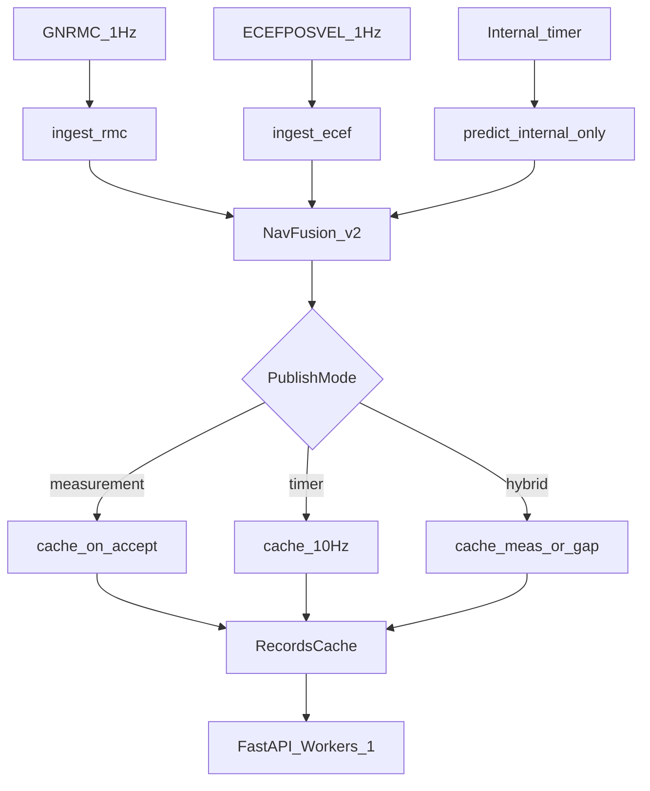

# KALMAN-ECEF-FUSION v2

> Наследует [KALMAN-ECEF-PLAN.md](KALMAN-ECEF-PLAN.md). Документ v1 описывает базовую fusion-архитектуру; **v2** исправляет дефекты стоянки, ложной скорости и рассинхрона кэша API.

## 1. Диагноз v1

| Дефект | Симптом | Причина в коде |
|--------|---------|----------------|
| Ложная скорость на стоянке | API 23 км/ч при RMC 0 узлов | `_speed_course` на тиках 10 Гц (Δ/0.1 с) |
| Увод позиции | API ≠ GPS на сотни метров | predict 10 Гц + reject корректирующего RMC |
| Гейты ломают «RMC = истина» | Валидный RMC не принимается | `P_prev` = `_last_pub_*`, dt ≈ 0.1 с |
| Standstill не работает | Дрожание на стоянке | `_update_standstill` только в `ingest_ecef` |
| Quality врёт | `GOOD` при reject | early return в `_refresh_quality` |
| Старый API при свежем логе | `time` отстаёт на часы | `Workers > 1` — кэш в воркерах устарел |

## 2. Целевая архитектура

### Принципы v2

| # | Принцип |
|---|---------|
| 1 | RMC `is_valid=A`, `mode ∈ RmcTrustModes` — hard reset при kinematic conflict |
| 2 | Гейты: `P_prev` = `_last_rmc_*`, `dt ≥ 0.5` с |
| 3 | Predict внутренний; публикация по `PublishMode` |
| 4 | Speed/course: RMC/ECEF поля → Δ измерений → Kalman v |
| 5 | Standstill в `ingest_rmc` |
| 6 | Reject → `COAST` / `DEGRADED`; не держать `GOOD` |
| 7 | `[API].Workers = 1` обязательно |

## 3. Конфигурация

### `[Navigation]`

| Ключ | Тип | Default | Описание |
|------|-----|---------|----------|
| `PublishMode` | `measurement` \| `timer` \| `hybrid` | `measurement` | Политика записи в кэш |
| `OutputRateHz` | 1–20 | `10` | Внутренний predict; публикация при `timer`/`hybrid` |
| `Profile` | tram \| bus \| custom | `tram` | Секция VehicleProfiles |
| `VehicleProfilesPath` | path | `VehicleProfiles.toml` | Файл профилей |

### `PublishMode`

| Значение | Поведение |
|----------|-----------|
| `measurement` | Кэш только при accept RMC/ECEF |
| `timer` | Predict + publish каждые `1/OutputRateHz` с (как v1) |
| `hybrid` | `measurement` при `GOOD`; timer при `KF_ECEF`/`COAST`/`DEGRADED` и `t_since_rmc > 1` с |

### `[API]`

| Ключ | Default | Описание |
|------|---------|----------|
| `Workers` | `1` | Должен быть 1: in-memory кэш в процессе reader/fusion |

### VehicleProfiles (дополнительно)

| Ключ | Default | Описание |
|------|---------|----------|
| `RmcSpeedZeroKmh` | `0.5` | Порог «скорость ≈ 0» из RMC (км/ч) |
| `RmcTrustModes` | `A`, `D` | Режимы RMC для hard reset |

## 4. Состояние NavFusion

- `_last_rmc_lat/lon/mono` — предыдущий seen RMC (гейты)
- `_last_accept_lat/lon/mono` — последнее принятое измерение
- `_last_meas_speed/direction` — из парсера
- `_reject_streak` — подряд reject → `DEGRADED` при ≥ 3
- `_last_pub_*` — только для timer `_speed_course` fallback

## 5. ingest_rmc

1. Гейты от `_last_rmc_*`, `dt = max(now - _last_rmc_mono, 0.5)`.
2. Kinematic gates только для недоверенного RMC (`V`, `mode ∉ TrustModes`).
3. Доверенный RMC + gate fail → `_hard_reset_to_rmc`.
4. Standstill от `_last_accept_*`; не сбрасывать при малых `dist`.
5. `speed < RmcSpeedZeroKmh` и `dist < StandstillPosM` → `v = 0`.
6. Reject недоверенного → `COAST`; streak ≥ 3 → `DEGRADED`; publish только в `timer`.

## 6. Speed / direction (API)

1. `GOOD` + `nmea` → поля RMC
2. `KF_ECEF` → поля ECEF
3. `COAST`/`DEGRADED` → Δpos / Δt измерений (≥ 0.5 с)
4. `_frozen` → 0
5. Fallback: `‖v‖` Kalman; timer mode: `_speed_course`

## 7. Критерии приёмки

- [ ] Стоянка ≥ 10 мин: speed ≤ `RmcSpeedZeroKmh`, drift < 2 м (tram)
- [ ] При `PublishMode=measurement` и `nav-quality=GOOD`: `last-coords` совпадает с последним accept RMC (позиция из GPS, не predict)
  Для `timer` / `hybrid` допускаются predict-точки в кэше — см. `PublishMode` в §3.
- [ ] `PublishMode=measurement`: нет записей между RMC
- [ ] Reject недоверенного RMC: `quality ≠ GOOD`
- [ ] Hard reset: drift 300 м → позиция RMC, `GOOD`
- [ ] `Workers=1`: API актуален сразу после лога
- [ ] Bus 80 км/ч + ECEF gap ≤ 10 с: hybrid/timer OK

## 8. Ссылки

- Реализация: `src/navigation/fusion.py`, `src/runner_task.py`
- Enums: `src/navigation/enums.py`
- Конфиг: `src/models/data_models.py`
