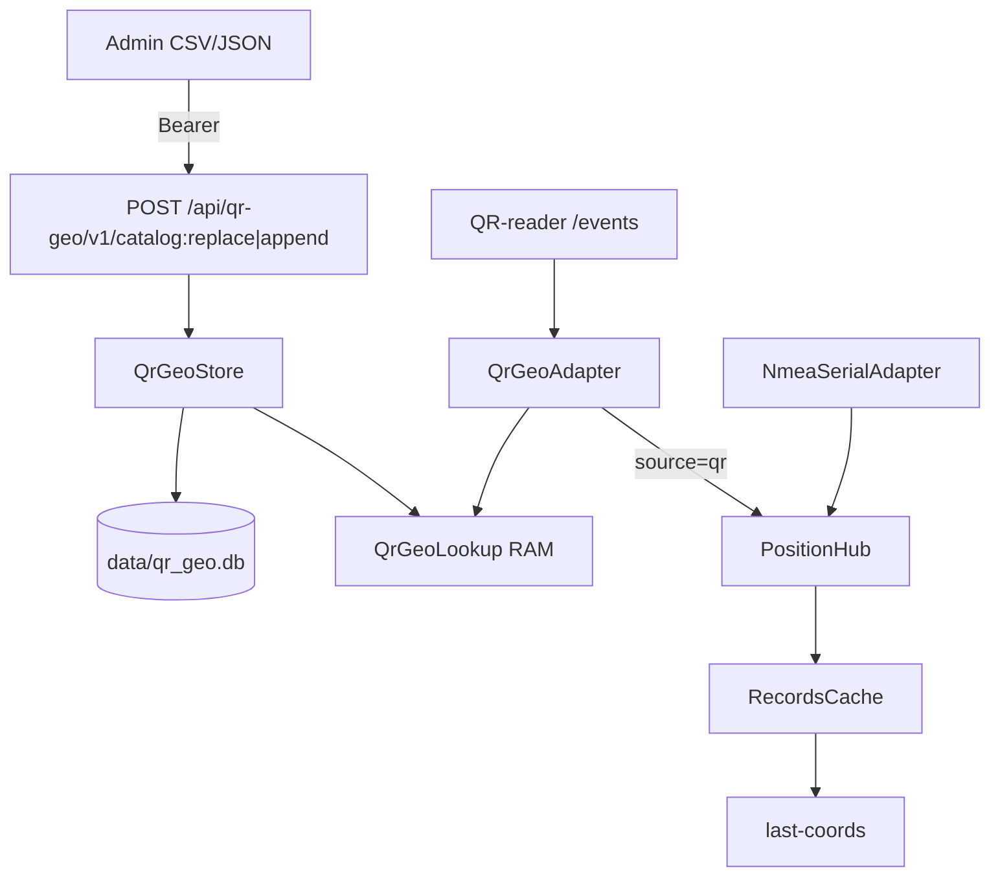

# План: QR-geo store, lookup, adapter

Реализация провайдера `qr`: отдельный SQLite-справочник с загрузкой CSV/JSON под Bearer, `QrGeoLookup` + `QrGeoAdapter` (SSE), автотесты nmea+qr (без e2e) и документация. Один токен на все защищённые API — через `.env` и переменную окружения в compose.

## Зафиксированные решения

**Токен:** только **`.env` + переменная окружения в compose**. Без `TokenFile`, без mount секрета.

- На хосте файл `.env` (в `.gitignore`): `NAVAPI_API_TOKEN=<секрет>`
- В compose: `env_file: .env` и/или `environment: NAVAPI_API_TOKEN: ${NAVAPI_API_TOKEN}`
- Код при старте: `os.environ["NAVAPI_API_TOKEN"]`, fallback на `API.Token` из TOML **только для pytest/local**
- Один токен на legacy и `/api/qr-geo`
- Ротация: сменить значение в `.env` → recreate контейнера → обновить Bearer у клиентов

**Тесты:** **не e2e**. Автотесты с mock SSE + file/fake NMEA. Проверка на реальной камере и навигационном модуле — на **стендовой среде**, не в этом плане/CI.

**Координаты:** default hemi `N`/`E`; lat/lon `< 0` — ошибка; только N/E.

## Архитектура

## 1. Конфиг и токен

Файлы: `src/models/data_models.py`, `etc/gnrmc-provider.toml`, docker-конфиги.

- Резолв токена: **`NAVAPI_API_TOKEN` → `API.Token`** (без TokenFile).
- `[Sources.qr-geo]`: `EventsUrl`, `GeoDbPath`, `ConnectTimeoutMs`, `ReconnectMinMs`/`ReconnectMaxMs`, `DedupWindowSec` (по умолчанию 5).
- Убрать plaintext боевых токенов из примеров в git → пусто/placeholder; описать `.env`.
- В `src/api_server.py`: не логировать значение токена при `401`; пути `/api/qr-geo/` требуют Bearer (как legacy).

Docker (`docker/docker-compose.dev.yml`, prod compose, README-deploy):

- `env_file: .env` и/или `environment: NAVAPI_API_TOKEN: ${NAVAPI_API_TOKEN}`.
- Пример `.env.example` с ключом `NAVAPI_API_TOKEN=` (без значения).
- Каталог для `qr_geo.db` (rw volume рядом с `/db`).

## 2. QrGeoStore + парсер/валидация + API

Новые модули:

- `src/qr_geo/store.py` — SQLite `qr_geo` (`qr_value PK`, lat/lon, hemi, label, enabled), `replace_all`, `upsert_many`, `load_all_enabled`.
- `src/qr_geo/lookup.py` — `QrGeoLookup`: dict, `get` / `reload`.
- `src/qr_geo/parse.py` — CSV/JSON → raw rows.
- `src/qr_geo/validate.py` — нормализация и правила ниже.
- `src/api/qr_geo_routes.py` — два POST; подключение в `create_app`.

Эндпоинты:

- `POST /api/qr-geo/v1/catalog:replace` — полная перезапись + `lookup.reload()`.
- `POST /api/qr-geo/v1/catalog:append` — upsert по `qr-value` + обновление lookup.

Вход: `multipart/form-data` поле `file` (`.csv`/`.json`) или raw JSON body. Пустой replace → `422`.

Нормализация lat/lon: strip → снять кавычки → если есть `,` и нет `.` → `,`→`.` → `float`.

Валидация: обязательные `qr-value`, `latitude`, `longitude`; lat ∈ [0, 90], lon ∈ [0, 180]; hemi только `N`/`E` или default; дубликаты в файле — ошибка; лимит размера/числа строк. При ошибках — `422` с `errors[{row, field, message}]`, БД не менять.

Store+Lookup инициализировать при старте с `GeoDbPath` (default `data/qr_geo.db`) даже если `[Sources.qr-geo] Enabled=false`, чтобы справочник можно было залить заранее.

## 3. QrGeoLookup

- Загрузка всех `enabled=1` при старте и после replace/append.
- `get(qr_value) -> GeoPoint | None` для адаптера.
- `asyncio.Lock` на мутации store+lookup (Workers=1).

## 4. QrGeoAdapter

Заменить stub в `src/sources/stubs.py` / factory `src/sources/factory.py`:

- `httpx` SSE на `EventsUrl` (`GET .../api/qr-reader/v1/events`).
- Только `event: qr-detected`; `ping` игнорировать; reconnect с backoff.
- miss → drop; hit → `hub.publish` с `source=SOURCE_QR`.
- Поля: `is_valid=A`, `speed=0`, `direction=0`, `mode=M`, `satellites_count=0`, `quality=GOOD`, time из события, hemi из справочника.
- Локальный dedup по `result` в окне `DedupWindowSec`.

## 5. Тесты (nmea + qr, без e2e)

- Юнит: normalize/validate.
- Store: replace/append, lookup reload.
- API: Bearer; CSV/JSON; 401; 422.
- Adapter: mock SSE → hit/miss.
- Интеграция в процессе: nmea (file/fixture) + qr (mock) → оба `source` в кэше; фильтры `provider=`.

Железо / реальная камера / QR-reader — **стенд**, не часть автотестов этого репозитория.

## 6. Документация

- `doc/API-PROTOCOL-v2.md`: `/api/qr-geo/v1`, CSV/JSON, валидация, Bearer.
- `README.md` / `docker/README-deploy.md`: `.env` + `NAVAPI_API_TOKEN`, `GeoDbPath`, ротация токена; указать, что полная проверка с камерой — на стенде.
- Комментарии в `etc/gnrmc-provider.toml`; обновить `plan/MULTI-SOURCE-POSITION-HUB.md`.

## Сознательно не делаем

- TokenFile / mount секрета.
- Поштучный CRUD / GET list / POST reload.
- Dual-token при ротации.
- Multi-source fusion QR+NMEA.
- E2E / CI с живым QR-reader и камерой.

## Чеклист реализации

- [ ] Резолв токена `NAVAPI_API_TOKEN` → `API.Token`; middleware для `/api/qr-geo`; compose `env_file`/`.env`
- [ ] QrGeoStore (отдельный SQLite), parse/validate CSV|JSON, POST catalog:replace и catalog:append
- [ ] QrGeoLookup: RAM dict, reload после мутаций
- [ ] QrGeoAdapter: SSE, lookup, dedup, `hub.publish` source=qr; factory вместо stub
- [ ] Автотесты валидации, store/API, mock SSE, интеграция двух провайдеров
- [ ] Документация API, deploy, toml, ротация токена
