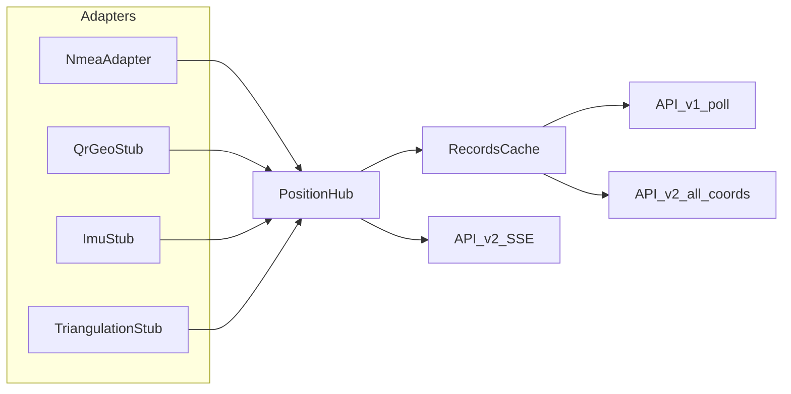

# План: multi-source Position Hub и API v2

## Как понята задача (фиксация ответов)

- **Одно поле `source`** с составными значениями: семейство NMEA — `nmea/rmc`, `nmea/ecef`, `nmea/fusion`; внешние — `qr`, `imu`, `triangulation` (без `/`, либо позже `qr/...` при необходимости).
- **Общий поток = interleave**: все включённые провайдеры пишут в один `RecordsCache`; «последняя» точка — новейшая среди всех (с опциональным фильтром).
- Query-параметр фильтра называется **`provider`**: это идентификатор семейства (= сегмент `source` до `/`, либо весь `source`, если слэша нет). Примеры: `provider=nmea` матчит `nmea/rmc|ecef|fusion`; `provider=qr` матчит `qr`.
- **QR→coords** сейчас только слот в конфиге + stub-адаптер; транспорт/lookup — при отдельной реализации.
- **Совместимость:** пути legacy и `/api/navigator/v1/` сохраняем; в `source` на всех версиях API — **новый составной формат** (без маппинга в старый enum). Новый контракт эндпоинтов — пути **`/api/navigator/v2/`**.
- **v2 API (новый):**
  1. **SSE** `GET /api/navigator/v2/last-coords?provider=` — поток обновлений последней точки (фильтр опционален).
  2. **GET** `/api/navigator/v2/all-coords?provider=&from=&to=` — выборка с опциональными фильтрами; **лимит 1000** точек.



---

## Зафиксированные решения (без развилок)

| Тема | Решение |
|------|---------|
| Хранение | В кэше/SQLite пишется **полный** `source` (`nmea/rmc`, …). |
| `source` во всех API | Единый новый формат везде: legacy, `/api/navigator/v1/`, `/api/navigator/v2/`. Маппинг в старый enum (`nmea`/`ecef`/`fusion`) **не делаем**. |
| SSE `last-coords` | При подключении — сразу текущий last (если есть); далее на каждую новую точку Hub (с фильтром `provider`) — **только** `data:` + JSON **в том же формате, что тело ответа** `GET /api/navigator/v1/last-coords`. Имени события нет. Если пауза между отправками **> KeepaliveInterval** — SSE-событие `ping`. |
| Конфиг железа | Секции `[Hardware]` больше нет: `HardwarePort`/`Baud` (и аналоги) живут **внутри секции провайдера** (`[Sources.nmea]`, позже `[Sources.imu]`, …). |
| Auth | `/api/navigator/v2/*` — **публичные**, как `/api/navigator/v1/*` ([`_is_public_v2_path`](src/api_server.py)). |
| Stubs | При `Enabled=true` только логируют «not implemented» / no-op цикл и **не** шлют фейковые координаты; при `Enabled=false` не стартуют. |
| Merge / multi-source Kalman | Не в этом этапе. |

---

## 1. Контракт события и Hub

Новый пакет, например [`src/sources/`](src/sources/):

- `events.py` — `NavPositionEvent` (provider id, timestamp, lat/lon/hemi, speed, course, `source`, `quality`, extras).
- `adapter.py` — `NavSourceAdapter` Protocol: `name`, `async def run(hub, stop)`.
- `hub.py` — `PositionHub`:
  - `async def publish(event)` → конвертация в `Record` → `RecordsCache.add`;
  - fan-out подписчикам SSE (asyncio queues), по образцу [`QR-reader-API/.../sse_hub.py`](QR-reader-API/qr-reader/app/services/sse_hub.py);
  - хелпер `matches_provider(source, provider_filter)`.
- `factory.py` — сборка адаптеров из конфига.
- `source_ids.py` — константы составных `source` / provider id.

Конвертация Hub→Record: переиспользовать поля текущего [`Record`](src/db/cache.py); `source` = полный составной id (тот же в legacy/v1/v2).

---

## 2. NMEA как первый реальный адаптер

Рефакторинг без смены поведения при одном включённом NMEA:

- Обернуть логику [`nmea_reader_task`](src/runner_task.py) + [`fusion_tick_task`](src/runner_task.py) / [`NavFusion`](src/navigation/fusion.py) в `NmeaSerialAdapter`.
- Публикация в Hub вместо прямого `cache.add` (или тонкая прослойка: fusion → event → Hub → cache).
- Значения `source` на выходе fusion:
  - измерение RMC → `nmea/rmc`;
  - ECEF → `nmea/ecef`;
  - predict/coast fusion → `nmea/fusion`.
- Обновить [`NavSource`](src/navigation/enums.py) (или ввести отдельные константы строк) под составные значения; внутренний fusion может хранить short-код и маппить при publish.

[`main.py`](src/main.py): вместо жёсткого запуска reader/tick — `PositionHub` + список enabled-адаптеров как asyncio tasks.

---

## 3. Конфиг провайдеров

Расширить [`etc/gnrmc-provider.toml`](etc/gnrmc-provider.toml) и [`load_config`](src/models/data_models.py).

**Перенос `[Hardware]`:** поля `HardwarePort` / `Baud` переезжают в секцию NMEA-провайдера. Отдельной `[Hardware]` в шаблоне не остаётся. У каждого провайдера в будущем может быть свой набор «железных»/транспортных ключей в той же секции.

Формат секций — именованные таблицы `[Sources.<name>]` (имя = id провайдера):

```toml
[Sources.nmea]
Enabled = true
Type = "serial-nmea"
HardwarePort = "/dev/ttyS3"
Baud = 9600
# Input / Stdin по-прежнему можно брать из [System] или продублировать здесь при рефакторинге

[Sources.qr-geo]
Enabled = false
Type = "qr-geo"
# Зарезервировано: будущий SSE QR-reader + lookup

[Sources.imu]
Enabled = false
Type = "imu"
# Пример будущих полей провайдера:
# Device = "/dev/imu0"
# SampleRateHz = 100

[Sources.triangulation]
Enabled = false
Type = "triangulation-http"
# Url = ""
# IntervalMs = 1000
# TimeoutMs = 500
```

`load_config`: парсить все таблицы под `[Sources.*]` в список провайдеров; для `nmea` читать `HardwarePort`/`Baud` из этой секции (обновить dataclass’ы: убрать или опустошить top-level `Hardware`, параметры — в `SourceProviderConfig`).

Обратная совместимость при чтении: если в файле ещё есть старый `[Hardware]`, а `[Sources.nmea]` нет — один раз смапить в виртуальный nmea-провайдер (чтобы не ломать существующие деплои). Новый `etc/gnrmc-provider.toml` — только `[Sources.nmea]`.

Factory стартует адаптеры с `Enabled = true`.

---

## 4. Stubs провайдеров

| Type | Имя `source` / provider | Поведение stub |
|------|-------------------------|----------------|
| `qr-geo` | `qr` | Класс + docstring: будущий вход — SSE QR-reader (`qr-detected` → opaque `result` → geo lookup). Без сети. |
| `imu` | `imu` | Stub под расчёт по акселерометру; no-op. |
| `triangulation-http` | `triangulation` | Stub HTTP-клиента оператора: поля Url/Interval/Timeout в конфиге парсятся, при enable — warn «not implemented», без запросов. |

Все реализуют `NavSourceAdapter`, регистрируются в factory.

---

## 5. API: сохранить v1, добавить v2

Файл [`src/api_server.py`](src/api_server.py) (+ при необходимости вынести routes/SSE в `src/api/`).

**Сохранить пути и поведение poll-эндпоинтов:**

- Legacy: `/LastCoords`, `/AllCoords`, `/DeleteRecord/...`
- Poll: `/api/navigator/v1/last-coords`, `.../all-coords`, `.../delete-record/...`
- В поле `source` — **новый формат** (`nmea/rmc`, …) без обратного маппинга; остальной JSON-контракт без изменений.

**Новое:**

### 5.1 SSE `GET /api/navigator/v2/last-coords`

- Query: `provider: str | None`
- `text/event-stream`
- **Координаты:** без `event:` — только `data:` + JSON. Тело **идентично** ответу `GET /api/navigator/v1/last-coords` (kebab-case), например при успехе:

```
data: {"result":true,"record":{"record-id":0,"time":"...","latitude":...,"source":"nmea/rmc",...}}

```

  при отсутствии данных — тот же shape, что у v1: `{"result":false,"error":"no data"}` (на connect, если кэш пуст / нет точек по фильтру).
- При connect — сразу текущий last по фильтру (или `result:false`).
- **Keepalive:** если с момента последней отправки клиенту прошло больше `KeepaliveInterval` — событие `ping`. Интервал — `[API].SseKeepaliveSec` (дефолт ~15 с).
- Подписка через `PositionHub.subscribe(provider_filter)`.

### 5.2 GET `/api/navigator/v2/all-coords`

- Query (все опциональны): `provider`, `from` (ISO8601 UTC), `to` (ISO8601 UTC).
- Жёсткий **max 1000** точек (новее→старее или по `time` в диапазоне).
- Источник: snapshot кэша + при нехватке SQLite с `WHERE` по `source`/`datetime` (индекс/префиксный матч для `provider=nmea` → `source LIKE 'nmea/%' OR source = 'nmea'`).
- Ответ kebab-case, как v1 navigator; в `source` — полное составное значение.
- Невалидные `from`/`to` → `400`.

Обновить [`doc/API-PROTOCOL-v2.md`](doc/API-PROTOCOL-v2.md): явно разделить «текущий poll `/v1/`» и «новый `/v2/`»; описать `source`, `provider`, SSE.

---

## 6. Кэш, БД, оркестрация

- [`RecordsCache`](src/db/cache.py): методы выборки last/all с фильтром provider + time range (или хелперы рядом с API).
- [`db/sql.py`](src/db/sql.py): колонка `source` уже есть — расширить смысл значений; при необходимости индекс по `datetime`; миграция схемы не обязательна, если тип TEXT.
- [`main.py`](src/main.py): создать Hub(cache), передать в `create_app`; стартовать только enabled adapters + db_flusher + uvicorn.
- Auth middleware: добавить `path.startswith("/api/navigator/v2/")`.

---

## 7. Документация / комментарии под будущий QR

Краткий design-note в коде stub `qr-geo` и/или абзац в API/plan doc:

- Вход: SSE `GET .../api/qr-reader/v1/events`, event `qr-detected`, поле `result` — ключ lookup.
- Координат в QR-reader нет — lookup вне QR-reader.
- В NavAPI пока только Type=`qr-geo` + Enabled.

---

## 8. Порядок реализации

1. `NavPositionEvent` + `PositionHub` + provider matching; единый `source` без v1-маппинга.
2. Рефакторинг NMEA/fusion → адаптер; wire в `main`.
3. TOML `[Sources.<name>]` + перенос Hardware в `[Sources.nmea]` + factory; legacy `[Hardware]` → fallback в nmea.
4. Stubs: `qr-geo`, `imu`, `triangulation-http`.
5. API v2: all-coords filters + SSE last-coords (data = формат v1/last-coords) + ping keepalive; public auth.
6. Обновить `API-PROTOCOL-v2.md` (в т.ч. новые значения `source` на v1/legacy); smoke: NMEA-only; stub enable без фейковых точек; SSE + filter.

---

## Вне scope (явно)

- Реализация QR→coords / подключение к QR-reader.
- Реальный IMU и API сотового оператора.
- Multi-source fusion / primary-fallback.
- Message bus (NATS/Redis).
- Обратный маппинг `source` в старый enum для v1/legacy.
- Смена путей/полей legacy и `/api/navigator/v1/` (кроме значения `source`).
